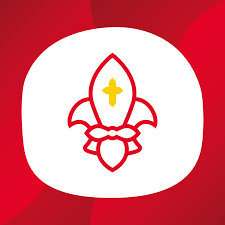

 

MiQuik je zkratka pro tak zvaný Mikulášský víkend, kterou pořádá Junák- český skaut od roku 1992, pro členy starší 15 let (rovery). Akce se koná vždy začátkem prosince kolem svátku svatého Mikuláše a skládá se z několika částí.

Polibek múzy: 
Polibek Múzy je titulován jako kulturně-umělecká iniciativa a soutěž. Skládá se totiž ze dvou základních částí: umělecké Soutěže a kulturního Festivalu. Festival slouží jako výstava soutěžních děl, vyhlášení výherců a zároveň jako neformální večer doplněný workshopy. V minulých letech došlo ke spojení s Komponovaným večerem, zaměřeným na performativní umění – divadlo a koncerty.V soutěži se můžete účastnit v těchto kategoriích:

Fotografie: 
Digitální, analogová, černobílá, série nebo detail

Hudba: 
Účastnící mohou složit svou vlastní píseň.

Literatura: 
Kategorie literatury je rozdělena na poezii a prózu – účastnící si vyberou klidně obě tyto podkategorie a napíší své soutěžní (spíše kratší) dílo.

Video: 
Účastnící natočí video do 5 minut, pak jej nahrají na videoserver (YouTube, Vimeo).

Výtvarno: 
Účastnící si mohou zvolit oblíbenou techniku, kterou rádi používají při umělecké činnosti. O tuto příležitost nejsou ochuzeni ani příznivci digitálního umění nebo třeba webdesignéři.

<iframe width="560" height="315" src="https://www.youtube.com/embed/Ir4O7ReXvkU" frameborder="0" allow="accelerometer; autoplay; encrypted-media; gyroscope; picture-in-picture" allowfullscreen></iframe>

Další částí je Mikulášský seminář:
Jedná se blok tematických přednášek se zajímavými lidmi.

<iframe width="560" height="315" src="https://www.youtube.com/embed/eRR0lG8WhaA" frameborder="0" allow="accelerometer; autoplay; encrypted-media; gyroscope; picture-in-picture" allowfullscreen></iframe>

Poté je to Taneční večer, Filmová sobota a Nedělní snídaně

Taneční večer je večer plný skvělé zábavy, překvapivých setkání a hlavně tance.

<iframe width="560" height="315" src="https://www.youtube.com/embed/tKW8pOmCohY" frameborder="0" allow="accelerometer; autoplay; encrypted-media; gyroscope; picture-in-picture" allowfullscreen></iframe>

 Filmová sobota je pro všechny, kteří se rádi dívají na zajímavé filmy a rádi o nich diskutují a po celém víkendu následuje nedělní snídaně.

<iframe width="560" height="315" src="https://www.youtube.com/embed/lPxytsGhhkg" frameborder="0" allow="accelerometer; autoplay; encrypted-media; gyroscope; picture-in-picture" allowfullscreen></iframe>

