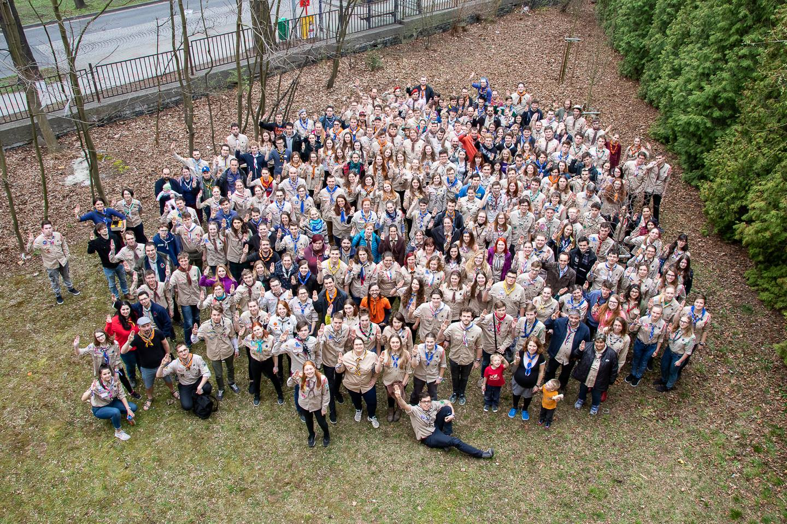
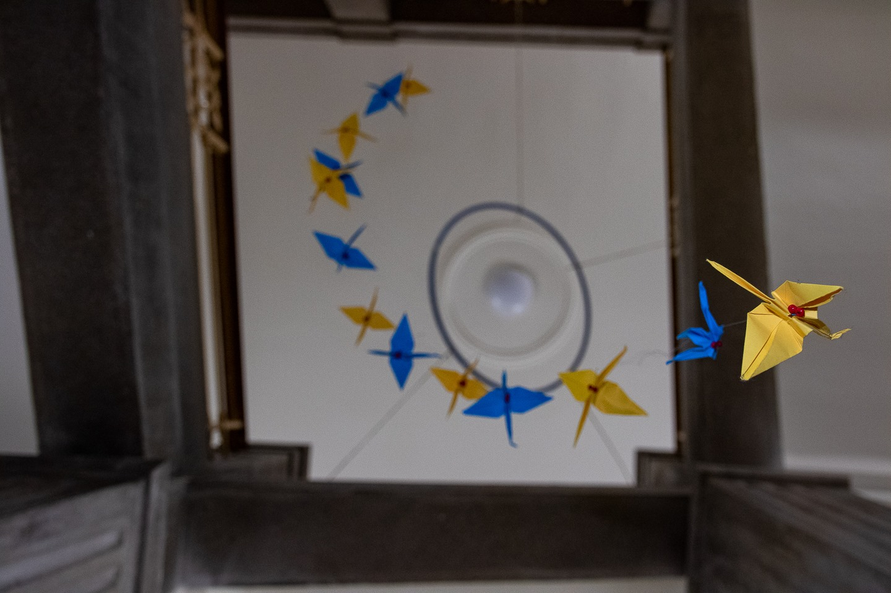

Letošní elixír se konal o předposledním březnovém víkendu a vzali si ho na starost skauti z kolínského střediska. Tématem, které celou akci provázelo se stalo sousloví "tváří v tvář", v jehož duchu se nesly vizuál a samozřejmě také veškerý program. Celkem bylo představeno sedm tváří, které poskytly teoretické a filozofické ukotvení celé akce. 

Samozřejmostí bylo tváří v tvář dětskému světu, tváří v tvář lidem a tváří v tvář sobě, nebyly ovšem opomenuty ani budoucnost, dnešní výzvy nebo krása. Elixír dodržel klasickou formu přednášek a workshopů, které se spolu s téměř veškerou ostatní aktivitou odehrávaly v prostorách kolínského gymnázia. Nechyběl ani bohatý vedlejší program především kulturního a relaxačního rázu. Akci také doprovodilo zasedání náčelnictva junáka, které probíhalo během celého víkendu.  

 

 

