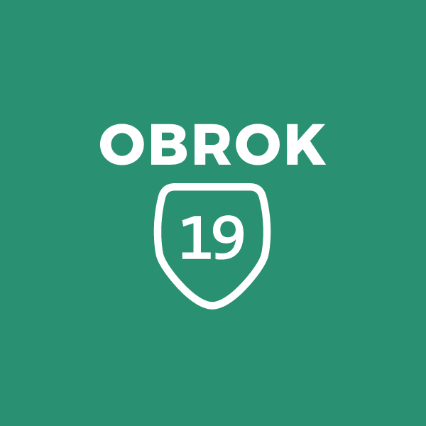

Obrok je pětidenní festival skautingu. Tyto dny jsou plné zábavy, nezapomenutelných zážitků a vzdělávání zároveň. Je akcí, která dává všem skautům možnost vzájemně se inspirovat, setkat se se starými přáteli a seznámit se s novými. Je akcí, kde účastníci mohou získat inspiraci, motivaci a nové znalosti, které následně uplatní ve svých oddílech. Jedná se o jistou formu odměny pro všechny skautské vedoucí, kteří celoročně dobrovolně pracují ve svých oddílech na výchovné činnosti s dětmi.

V roce 2019 budeme slavit výročí 30 let svobodného skautingu, který se po Sametové revoluci potřetí obnovil. Chceme tak účastníkům pomocí symbolického rámce (tématu akce) připomenout, jakou cestou si musela naše organizace projít během své více než stoleté historie. Společně tak projdeme cestu od jejího založení, přes rozkvět, pád pod rukama totality, až po dnešní svobodné fungování.

Zároveň dáme skautům možnost odnést si z Obroku spoustu zážitků, zúčastnit se zajímavých přednášek a workshopů, setkat se s významnými osobnostmi z různých oborů a navázat přátelství s dalšími skauty z celé republiky, kteří sdílí stejné hodnoty.

Přikládám oficiální web letošního obroku: https://obrok19.cz/

